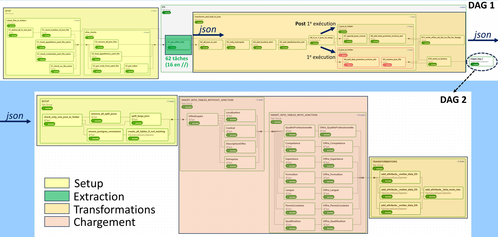
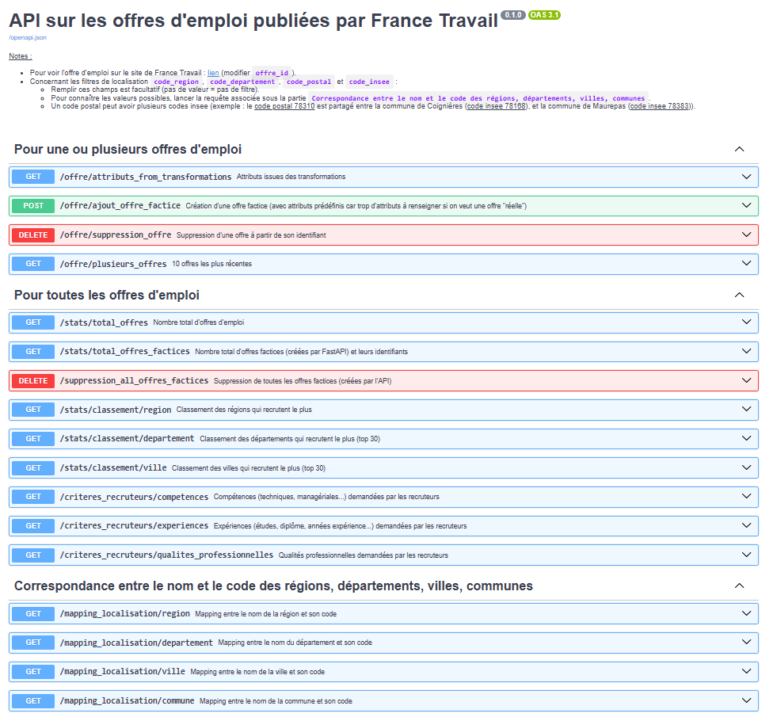
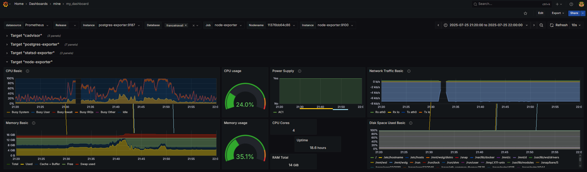
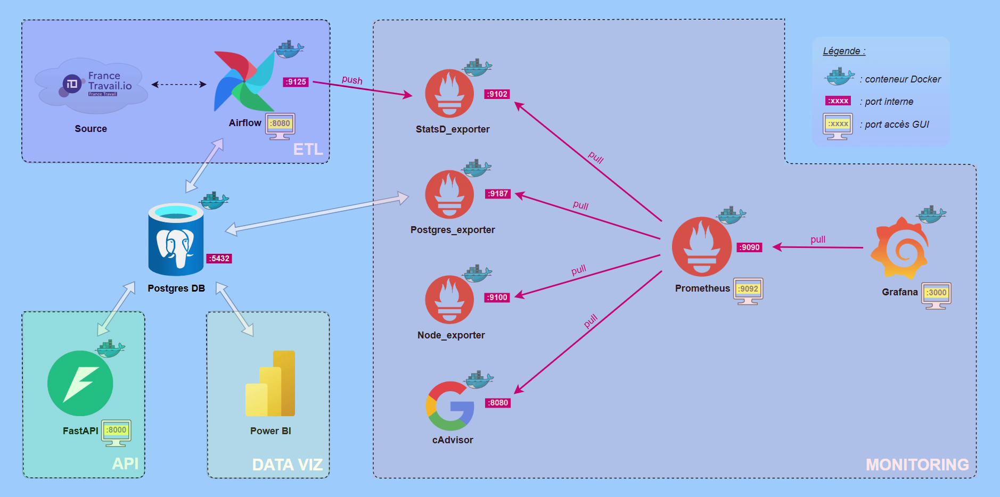

# 📊 Projet Data Engineer (2025)

**Analyse des offres d’emploi de la data et de la tech en France**

📹 <u>Slideshow</u>

  

    <video controls muted style="width: 100%; height: auto;">
      <source src="/videos/project-DE-slideshow.mp4" type="video/mp4">
    </video>
  

🎯 <u>Résultats</u>

  - Pipeline de données robuste exécuté quotidiennement
  - 200k offres d’emploi agrégées en 10 mois

📈 <u>Exemples d’insights</u>

  - Compétences et soft skills les plus demandés par les recruteurs
  - Mots-clés les plus récurrents dans les offres d’emploi

📝 <u>Actions</u>

- Pipeline ETL/ELT avec orchestration de tâches exécutés quotidiennement *[Airflow]* :

  

  <!--  -->

  - Collecte des offres d'emploi avec l'API de France Travail (JSON) :
    - Requêtes pour 60 métiers de la tech, dont ceux de la data
    - Parallélisation des requêtes avec gestion des erreurs 429 ("too much requests")

  - Transformations des données avant stockage *[Python]* :
    - Conservation des offres d'emploi en France métropolitaine uniquement
    - Ajout des données de localisation des offres d'emploi (ville, département, région) à partir de données récupérées sur le site de l'Insee, parfois à partir des coordonnées gps (avec la librairie Python geopy)

  - Stockage dans une base de données relationnelle *[PostgreSQL]*, avec une modélisation en flocon de neige

  - Transformations des données après stockage *[SQL]* :
    - Ajout d'un attribut pour préciser si l'offre d'emploi est pour un DA, un DE ou un DS
    - Ajout d'un attribut pour si l'offre d'emploi contient des mots-clés prédéfinis

- Développement d’une API *[FastAPI]* :

  

  - Paramètres pour filtrer les offres d'emploi par leur localisation (région, département, ville), les offres d'emploi valides, et par les métiers de la data (Data Analyst, Data Engineer, Data Scientist)
  - Consultation des attributs d'une offre d'emploi par son identifiant
  - Voir les offres les plus récentes
  - Ajout, suppression d'une offre factice
  - Affichage de statistiques : nombre total des offres d'emploi, classements des régions/départements/villes qui recrutent le plus
  - Affichage des critères les plus demandés par les recruteurs, par exemple pour un Data Engineer :
    - la compétence la plus demandée : "Analyser, exploiter, structurer des données"
    - la qualité professionnelle la plus demandée : "Faire preuve d'autonomie"

- Conception de dashboards BI *[PowerBI]* :

  

- Mise en place d’un système de monitoring *[Grafana/Prometheus]* :

    

  - Supervision des métriques d'Airflow (statsd_exporter), du serveur (node_exporter), de la base de données (postgres_exporter) et des conteneurs (cadvisor)

- Conteneurisation du projet avec Docker Compose *[Docker]* :

  

🛠️ <u>Stack</u>

  - Python, Airflow, PostgreSQL, SQL, FastAPI, Power BI, Prometheus, Grafana, Docker

🔗 <u>Liens</u>

  - [Github](https://github.com/vimchun/Job-Market-in-France/)
  - [Github Pages](https://vimchun.github.io/Job-Market-in-France/)

---

# 📊 Projet Data Analyst (2024)

**Analyse et prédiction des délais d’intervention des brigades de pompiers de Londres**

🎯 <u>Résultats</u>

  - Création de data viz à partir de données totalisant 4 millions de lignes et 60 colonnes
  - Prédiction avec un modèle de classification et une précision de 70%

📈 <u>Exemples d’insights</u>

  - Coûts liés aux fausses alertes
  - Causes les plus fréquentes des retards

📝 <u>Actions</u>

  - Manipulation et préparation de la data, vérification de la qualité et la fiabilité des données
  - Storytelling avec mise en œuvre de tableaux de bord décisionnels
  - Features engineering et machine learning pour estimer les délais d’intervention

🛠️ <u>Stack</u>

  - Python, Jupyter Notebook, Pandas, PySpark, Power BI, Scikit-learn

🔗 <u>Liens</u>

  - A venir

